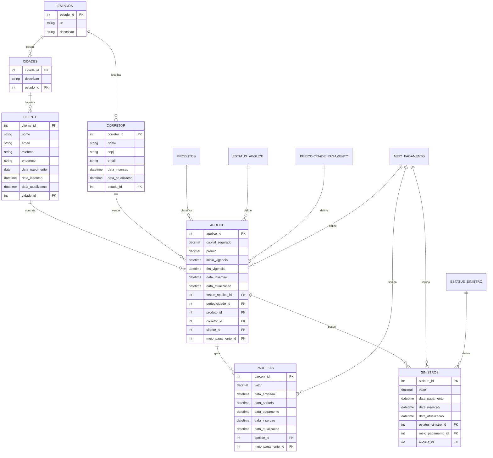

# Forlife Insurance Company

Projeto de dados para uma seguradora que vende apólices nos segmentos de vida,
automóvel e residência.

O objetivo inicial é criar uma base relacional em PostgreSQL com dados
sintéticos, coerentes com regras de negócio, para apoiar estudos de modelagem,
engenharia de dados, qualidade de dados e consumo analítico.

## Missão

Criar um ambiente de dados que permita análise e compartilhamento rápido das
informações de diferentes sistemas da companhia, mantendo governança sobre os
ativos de dados.

## Status Atual

- Projeto Python empacotado com `src/forlife_seed`.
- Gerenciamento de dependências com Poetry.
- Versão Python controlada com `.python-version`.
- Configuração por variáveis de ambiente via `.env`.
- Modelos relacionais criados com SQLAlchemy.
- Seed de dados sintéticos usando Faker.
- Comando de linha de comando: `forlife-seed`.
- Modelo ERD salvo em `src/forlife_seed/assets/database_diagrama.erd.json`.

## Estrutura do Projeto

```text
forlife-insurance-company/
  .env.example
  .gitignore
  .pre-commit-config.yaml
  .python-version
  poetry.lock
  pyproject.toml
  README.md

  src/
    forlife_seed/
      __init__.py
      config.py
      seed.py

      assets/
        database_diagrama.erd.json

      database/
        __init__.py
        database.py

      models/
        __init__.py
        apolice.py
        cliente.py
        corretor.py
        dominios.py
        parcelas.py
        sinistros.py

      seed/
        __init__.py
        bootstrap.py
        factories.py
        runner.py
        types.py
```

### Papel dos principais módulos

- `config.py`: leitura e validação das variáveis de ambiente.
- `database/database.py`: criação do engine, sessões e classe base do SQLAlchemy.
- `models/`: definição das tabelas relacionais.
- `seed/bootstrap.py`: carga das tabelas de domínio.
- `seed/factories.py`: fábricas de dados sintéticos.
- `seed/runner.py`: orquestração da execução do seed.
- `assets/database_diagrama.erd.json`: arquivo do modelo ERD.

## Requisitos

- Python `3.14.2`
- pyenv ou pyenv-win
- Poetry `2.x`
- PostgreSQL disponível localmente ou em container

## Inicialização do Ambiente

### 1. Instalar a versão do Python com pyenv

No Windows com pyenv-win:

```powershell
pyenv install 3.14.2
pyenv local 3.14.2
python --version
```

Em Linux/macOS com pyenv:

```bash
pyenv install 3.14.2
pyenv local 3.14.2
python --version
```

O arquivo `.python-version` já aponta para:

```text
3.14.2
```

### 2. Configurar o Poetry para criar a venv no projeto

```bash
poetry config virtualenvs.in-project true
```

### 3. Instalar as dependências

```bash
poetry install
```

Para validar o projeto:

```bash
poetry check
```

## Variáveis de Ambiente

Crie o arquivo `.env` a partir do exemplo:

```bash
cp .env.example .env
```

No PowerShell:

```powershell
Copy-Item .env.example .env
```

Preencha as variáveis:

```env
DB_USER=postgres
DB_PASSWORD=postgres
DB_HOST=localhost
DB_PORT=5432
DB_NAME=seguros
```

O arquivo `.env` não deve ser versionado. Ele já está coberto pelo
`.gitignore`.

## Banco de Dados

Crie previamente um banco PostgreSQL com o nome definido em `DB_NAME`.

Exemplo usando `psql`:

```bash
createdb seguros
```

Ou:

```bash
psql -U postgres -c "CREATE DATABASE seguros;"
```

As tabelas são criadas automaticamente pelo script de seed por meio de:

```python
Base.metadata.create_all(get_engine())
```

## Execução do Seed

O comando principal do projeto é:

```bash
poetry run forlife-seed
```

### Execução única

```bash
poetry run forlife-seed --mode once --batch-size 20
```

### Execução contínua

```bash
poetry run forlife-seed --mode continuous --batch-size 10 --interval-seconds 30
```

### Execução reprodutível

Use `--seed` para controlar a aleatoriedade:

```bash
poetry run forlife-seed --mode once --batch-size 20 --seed 42
```

## Regras de Negócio do Seed

- As tabelas de domínio são carregadas na primeira execução.
- Antes de uma venda de apólice, deve existir um corretor cadastrado.
- Antes de uma venda de apólice, deve existir um cliente cadastrado.
- Toda apólice possui cliente, corretor, produto, periodicidade e meio de pagamento.
- A data de início de vigência da apólice respeita a existência prévia do cliente e do corretor.
- Um cliente pode ter uma ou várias apólices.
- Um corretor pode vender nenhuma, uma ou várias apólices.
- As parcelas são geradas dentro do período de vigência da apólice.
- Nem toda apólice possui sinistro.

## Modelo ERD

O modelo ERD do projeto está salvo em:

```text
src/forlife_seed/assets/database_diagrama.erd.json
```

Esse arquivo pode ser aberto em ferramentas compatíveis com o formato do
ERD Editor.

### Tabelas

- `cliente`
- `corretor`
- `apolice`
- `parcelas`
- `sinistros`
- `estados`
- `cidades`
- `produtos`
- `estatus_apolice`
- `periodicidade_pagamento`
- `meio_pagamento`
- `estatus_sinistro`

### Diagrama Lógico



## Comandos Úteis

Formatação:

```bash
poetry run black src
poetry run isort src
```

Análise de segurança:

```bash
poetry run bandit -r src -lll
```

Pre-commit:

```bash
poetry run pre-commit install
poetry run pre-commit run --all-files
```

## Melhorias

- criar testes automatizados;
- adicionar `docker-compose.yml` para subir PostgreSQL localmente;
