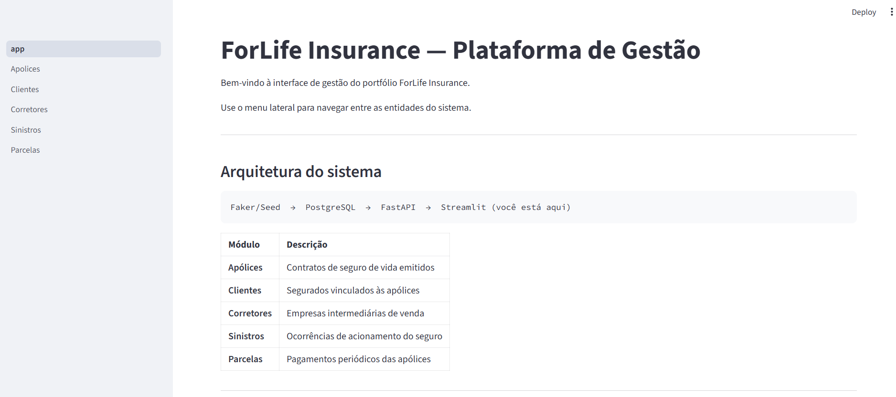
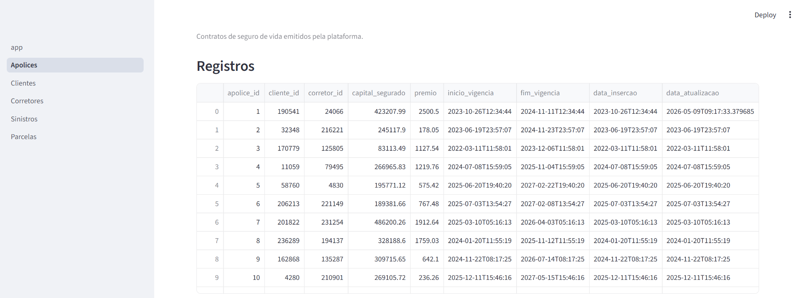
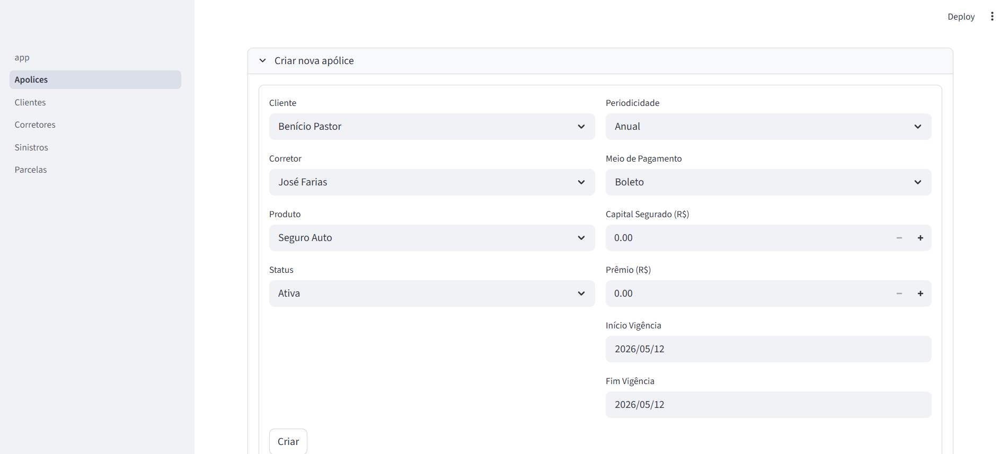
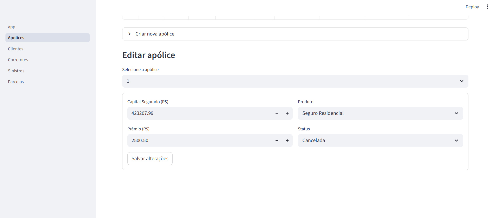
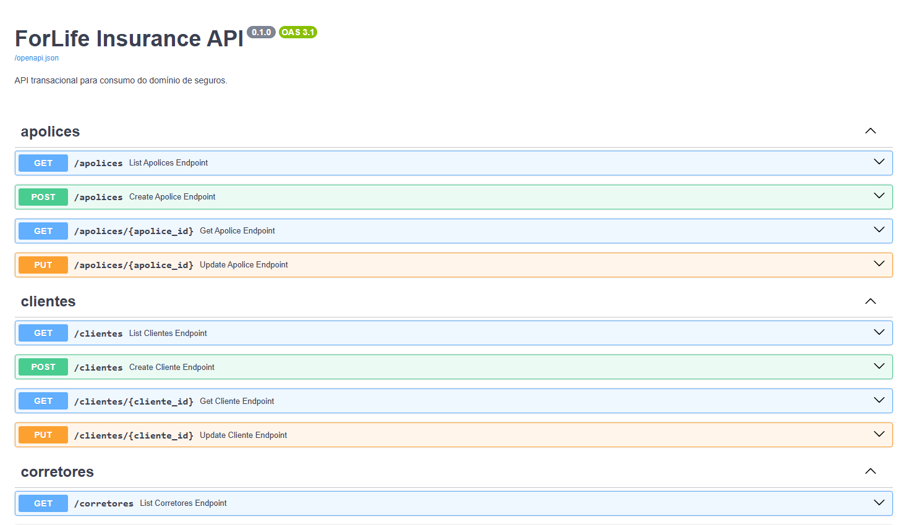

# Forlife Insurance Company


Projeto que simula um ambiente completo de uma seguradora de vida — do modelo de banco de dados a interface operacional. Cobre modelagem relacional com SQLAlchemy, geração de dados sintéticos com Faker, API transacional com FastAPI e interface de visualização com Streamlit, tudo organizado em um monorepo flat com virtualenv único.

## Arquitetura

```
                    ┌─────────────────┐
                    │  Streamlit UI   │  :8501
                    │  (forlife_ui)   │
                    └────────┬────────┘
                             │ HTTP
                    ┌────────▼────────┐
                    │   FastAPI API   │  :8000
                    │  (forlife_api)  │
                    └────────┬────────┘
                             │ SQLAlchemy
                    ┌────────▼────────┐
                    │   Core (ORM)    │
                    │ (forlife_core)  │
                    └────────┬────────┘
                             │
                    ┌────────▼────────┐
                    │   PostgreSQL    │
                    └─────────────────┘
                             ▲
                             │ SQLAlchemy
                    ┌────────┴────────┐
                    │   Seed (Faker)  │
                    │ (forlife_seed)  │
                    └─────────────────┘
```

## Pacotes

| Pacote | Responsabilidade |
|---|---|
| `forlife_insurance_core` | Biblioteca compartilhada: ORM models, configuração de banco, session management |
| `forlife_insurance_api` | FastAPI transacional — CRUD de apólices, clientes, corretores, sinistros e parcelas |
| `forlife_insurance_seed` | Gerador Faker para seed sintético do PostgreSQL |
| `forlife_insurance_ui` | Dashboard Streamlit para visualização dos dados |

## Screenshots

### Home

| Home | Lista de Apólices |
|---|---|
|  |  |

### Gestão de Apólices

| Criação | Edição |
|---|---|
|  |  |

### API — Endpoints



## Estrutura

```
forlife-insurance-company/
├── pyproject.toml
├── poetry.lock
├── .env                    # variáveis de conexão com o banco
├── .python-version
├── .pre-commit-config.yaml
├── pics/                   
└── projects/
    ├── forlife_insurance_core/
    │   ├── config.py
    │   ├── database/
    │   └── models/
    ├── forlife_insurance_api/
    │   ├── app.py
    │   ├── routers/
    │   ├── schemas/
    │   └── services/
    ├── forlife_insurance_seed/
    │   ├── runner.py
    │   ├── bootstrap.py
    │   └── factories.py
    └── forlife_insurance_ui/
        ├── app.py
        ├── pages/
        └── services/
```

## Pré-requisitos

- Python 3.12 (gerenciado via `.python-version`)
- [Poetry](https://python-poetry.org/) >= 2.0
- PostgreSQL em execução

## Instalação

```bash
git clone <repo-url>
cd forlife-insurance-company
poetry install
```

## Variáveis de Ambiente

Crie um `.env` na raiz com as credenciais do PostgreSQL:

```env
DB_USER=postgres
DB_PASSWORD=postgres
DB_HOST=localhost
DB_PORT=5432
DB_NAME=seguros
```

## Executar os Serviços

```bash
# API transacional (FastAPI)
poetry run task api

# Interface web (Streamlit)
poetry run task ui

# Seed do banco (carga única de dados sintéticos)
poetry run task seed
```

Por padrão a API sobe em `http://localhost:8000` e a UI em `http://localhost:8501`.  
A documentação interativa da API está disponível em `http://localhost:8000/docs`.

## Qualidade de Código

```bash
poetry run task lint         # formata código com black + isort
poetry run task lint-check   # verifica formatação sem alterar arquivos (CI)
poetry run task security     # análise estática com bandit
poetry run task test         # roda pytest
```

## Pre-commit

```bash
poetry install
pre-commit install
```

Os hooks rodam black, isort e bandit automaticamente a cada `git commit`.

## Contribuindo

1. Crie uma branch a partir de `main`
2. Rode `poetry run task lint` antes de commitar
3. Garanta que `poetry run task test` passa sem erros
4. Abra um Pull Request descrevendo as mudanças

## Próximos Passos

- [ ] Camada de testes com cobertura mínima de 80%
- [ ] Conteinerização com Docker e Docker Compose
- [ ] Autenticação JWT na API
- [ ] CI/CD com GitHub Actions (lint, security, tests)
- [ ] Migrations com Alembic
- [ ] Relatórios e gráficos analíticos
