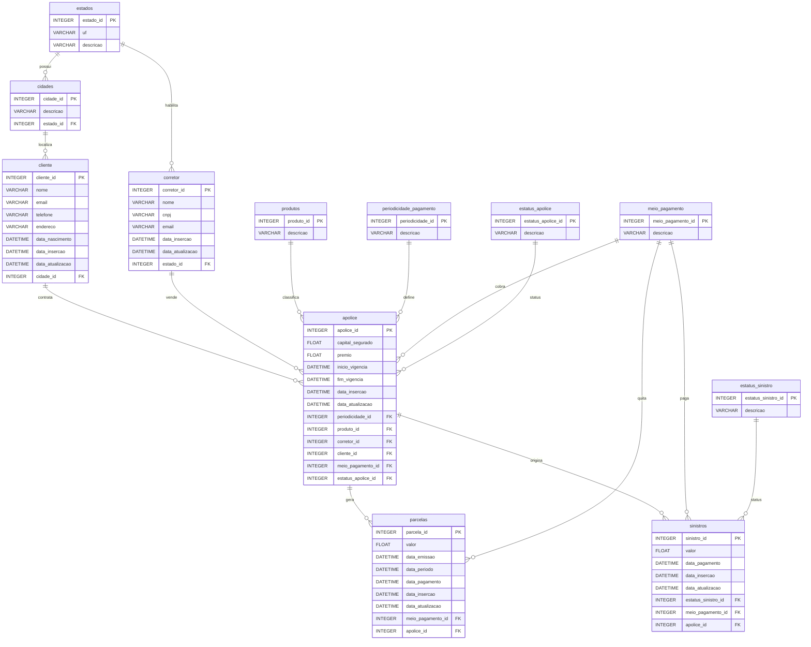

# Seed App

Aplicativo responsável por criar e popular a base PostgreSQL com dados
sintéticos coerentes com as regras de negócio da seguradora.

Este README cobre apenas o fluxo de seed. Para a visão geral do repositório,
consulte [README.md](../../README.md).

## Objetivo

Gerar uma base relacional para estudos de modelagem, engenharia de dados,
qualidade de dados e consumo analítico, preservando coerência entre clientes,
corretores, apólices, parcelas e sinistros.

## Código Relacionado

O seed está implementado em `src/forlife_insurance/seed`.

Principais módulos:

- `bootstrap.py`: carga inicial das tabelas de domínio.
- `factories.py`: geração de dados sintéticos.
- `runner.py`: orquestração da execução do seed.
- `types.py`: estruturas auxiliares para o fluxo de carga.

## Requisitos

- Pyenv `3.x`
- Python `3.14.2`
- Poetry `2.x`
- PostgreSQL disponível localmente ou em container

## Preparação do Ambiente

Defina a versão local do Python:

```bash
pyenv local 3.14.2
```

Instale as dependências:

```bash
poetry install
```

Crie o arquivo `.env` a partir do exemplo:

```bash
cp .env.example .env
```

Preencha as variáveis:

```env
DB_USER=postgres
DB_PASSWORD=postgres
DB_HOST=localhost
DB_PORT=5432
DB_NAME=seguros
```

## Banco de Dados

Crie previamente um banco PostgreSQL com o nome definido em `DB_NAME`.

Exemplo:

```bash
createdb seguros
```

Ou:

```bash
psql -U postgres -c "CREATE DATABASE seguros;"
```

As tabelas são criadas automaticamente durante a execução do seed.

## Como Executar

Comando principal:

```bash
poetry run forlife-seed
```

Execução única:

```bash
poetry run forlife-seed --mode once --batch-size 20
```

Execução contínua:

```bash
poetry run forlife-seed --mode continuous --batch-size 20 --interval-seconds 30
```

Execução reproduzível:

```bash
poetry run forlife-seed --mode once --batch-size 20 --seed 42
```

## Regras de Negócio

- As tabelas de domínio são carregadas na primeira execução.
- Antes de uma venda de apólice, deve existir um corretor cadastrado.
- Antes de uma venda de apólice, deve existir um cliente cadastrado.
- Toda apólice possui cliente, corretor, produto, periodicidade e meio de
  pagamento.
- A data de início de vigência da apólice respeita a existência prévia do
  cliente e do corretor.
- Um cliente pode ter uma ou várias apólices.
- Um corretor pode vender nenhuma, uma ou várias apólices.
- As parcelas são geradas dentro do período de vigência da apólice.
- Nem toda apólice possui sinistro.

## Modelo ERD

O diagrama-fonte do modelo relacional utilizado pelo seed está em:

```text
src/forlife_insurance/assets/database_diagrama.erd.json
```

O desenho abaixo mostra as tabelas e os relacionamentos entre elas:



## Comandos Úteis

Formatação:

```bash
poetry run black src
poetry run isort src
```

Análise de segurança:

```bash
poetry run bandit -r src -lll
```

Pre-commit:

```bash
poetry run pre-commit install
poetry run pre-commit run --all-files
```
