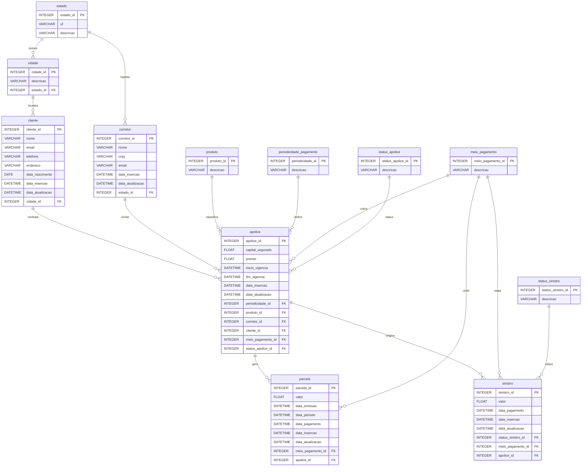

# Seed App

Aplicativo responsavel por criar e popular a base PostgreSQL com dados
sinteticos coerentes com as regras de negocio da seguradora.

Este README cobre apenas o fluxo de seed. Para a visao geral do repositorio,
consulte [README.md](../../README.md).

## Objetivo

Gerar uma base relacional para estudos de modelagem, engenharia de dados,
qualidade de dados e consumo analitico, preservando coerencia entre clientes,
corretores, apolices, parcelas e sinistros.

## Codigo Relacionado

O seed esta implementado em `src/forlife_insurance/seed`.

Principais modulos:

- `bootstrap.py`: carga inicial das tabelas de dominio.
- `factories.py`: geracao de dados sinteticos.
- `runner.py`: orquestracao da execucao do seed.
- `types.py`: estruturas auxiliares para o fluxo de carga.

## Requisitos

- Pyenv `3.x`
- Python `3.14.2`
- Poetry `2.x`
- PostgreSQL disponivel localmente ou em container

## Preparacao do Ambiente

Defina a versao local do Python:

```bash
pyenv local 3.14.2
```

Instale as dependencias:

```bash
poetry install
```

Crie o arquivo `.env` a partir do exemplo:

```bash
cp .env.example .env
```

Preencha as variaveis:

```env
DB_USER=postgres
DB_PASSWORD=postgres
DB_HOST=localhost
DB_PORT=5432
DB_NAME=seguros
```

## Banco de Dados

Crie previamente um banco PostgreSQL com o nome definido em `DB_NAME`.

Exemplo:

```bash
createdb seguros
```

Ou:

```bash
psql -U postgres -c "CREATE DATABASE seguros;"
```

As tabelas sao criadas automaticamente durante a execucao do seed.

## Como Executar

Comando principal:

```bash
poetry run forlife-seed
```

Execucao unica:

```bash
poetry run forlife-seed --mode once --batch-size 20
```

Execucao continua:

```bash
poetry run forlife-seed --mode continuous --batch-size 20 --interval-seconds 30
```

Execucao reproduzivel:

```bash
poetry run forlife-seed --mode once --batch-size 20 --seed 42
```

## Regras de Negocio

- As tabelas de dominio sao carregadas na primeira execucao.
- Antes de uma venda de apolice, deve existir um corretor cadastrado.
- Antes de uma venda de apolice, deve existir um cliente cadastrado.
- Toda apolice possui cliente, corretor, produto, periodicidade, status e meio
  de pagamento.
- A data de inicio de vigencia da apolice respeita a existencia previa do
  cliente e do corretor.
- Um cliente pode ter uma ou varias apolices.
- Um corretor pode vender nenhuma, uma ou varias apolices.
- As parcelas sao geradas dentro do periodo de vigencia da apolice.
- Nem toda apolice possui sinistro.

## Modelo ERD

O diagrama-fonte do modelo relacional utilizado pelo seed esta em:

```text
src/forlife_insurance/assets/database_diagrama.erd.json
```

O desenho abaixo mostra as tabelas e os relacionamentos entre elas:



## Comandos Uteis

Formatacao:

```bash
poetry run black src
poetry run isort src
```

Analise de seguranca:

```bash
poetry run bandit -r src -lll
```

Pre-commit:

```bash
poetry run pre-commit install
poetry run pre-commit run --all-files
```
